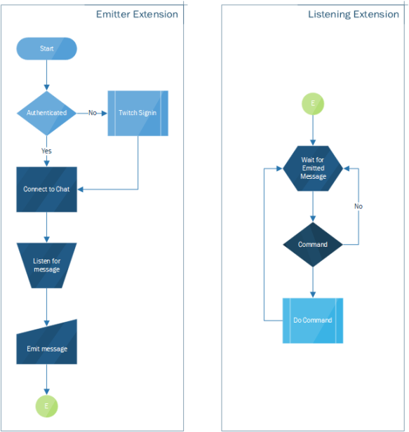

# Ttv Chat Emitter for VS Code

current branch|master branch
---|---
![Tests Badge][currentbadge]|![Tests Badge][masterbadge]

The Ttv Chat Emitter for VS Code extension provides a single sign-in and chat listener for VS Code extensions that interact with Twitch Chat. This extension will handle the authentication with Twitch using an OAuth token and receiving/sending of messages to/from Twitch's chat service and emit the receiving messages to all extensions that listen.

## API

This extension provides the following API endpoints:

- `sendMessage(message: string): Promise<void>` Used to send messages to the twitch chat service
- `onTtvClientConnectionChanged: Event<TtvClientConnectionChangedEvent>` Raised when the twitch chat client connects or disconnects
- `onTtvClientRecievedMessage: Event<TtvClientMessageReceivedEvent>` Raised whenever a message is received from twitch' chat service

`TtvClientConnectionChangedEvent` is an object with the following properties:

- `connected: boolean` Whether we're connected or disconnected
- `address: string` The server address we connected to
- `port: number` The port used to connect to the server

`TtvClientMessageReceivedEvent` is an object with the following properties:

- `username: string`
- `message: string`
- `badges: IBadges` with exception of `follower` the following are only present if they user has the badge
  - `admin?: string`
  - `bits?: string`
  - `broadcaster?: string`
  - `global_mod?: string`
  - `moderator?: string`
  - `subscriber?: string`
  - `staff: string`
  - `turby: string`
  - `premium: string`
  - `follower: string` either true or false

## Example Process Flow

[currentbadge]: https://github.com/parithon/vscode-ttvchat-emitter/workflows/Tests/badge.svg
[masterbadge]: https://github.com/parithon/vscode-ttvchat-emitter/workflows/Tests/badge.svg?branch=master